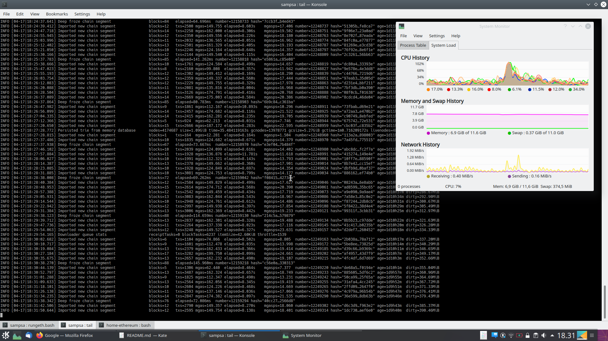

# Home Ethereum

*If you don't hold it, you don't own it*

-- an american proverb

My checklist and scripts for running [go ethereum client](https://github.com/ethereum/go-ethereum), aka "geth" on a laptop @ the comfort of your home.

The current version you should use is **v1.10.12**.  For release notes, see [here](https://blog.ethereum.org/2021/03/08/ethereum-berlin-upgrade-announcement/).

- 13.8.2020, a full sync took more than a month to sync and reach the last block, while the blockchain takes around 850 GB of space.
- 9.3.2021, the blockchain takes ~ 1.2 TB of space.
- 17.4.2021, the blockchain takes ~ 1.3 TB of space.
- 20.1.2022, removed blockchain & did a "snap" sync.  It was blazing fast & now blockchain just needs a few hundred gigas!  Using txlookuplimit=0 was a bad idea: it blows up the state trie



## The Hardware

### My "trash" setup

*I did this*

You don't want to recycle your old "ultrabook" laptop for this one, as they typically have an expensive NVME circuit working as the SSD drive, and no physical space / slot for inserting "commodity" SSD drives.

Prefer a larger gaming laptop with extendable SSD/HDD docks where you can install some cheap commodity SSDs and HHDs.

Keep in mind that **SSD is a must** for geth to work.

I cleaned the dust from an older Asus ROG (Republic of Gamers) laptop that has two docs for internal SSD/HHDs and recycled it for this purpose.

The SSD I'm using is a "Crucial BX500" 2TB drive, with an off-the-shelf price of around 200 EUR.

I also got a "Seagate Backup Plus Portable" 4TB external HDD drive for backing up the blockchain (~ 130 EUR).  This way I never have to download the god'damn thing again if something goes wrong.

**Backup is important!**  I have encountered many times a situations where the whole blockchain goes sour - due to bugs in geth or because of dirty shutdowns.  In these situations, geth
wants to reset the blockchain or it segfaults.  This can be avoided by recovering a "clean" blockchain from your backup HDD.

Amount of RAM in the laptop is ~ 12 GB.

### A More Serious Setup with ECC

*I might do this in the future*

Instead of using a retro / vintage laptop, like I'm doing here, or some other garbage-like-hardware you have lying around, you might want to consider
a server with ECC memory error correction.  Read more about it [here](https://arstechnica.com/gadgets/2021/01/linus-torvalds-blames-intel-for-lack-of-ecc-ram-in-consumer-pcs/).

When there are corruptions due to random bit flips, under normal consumer user-case scenarios, your computer might crash (just boot it again), or a single photo of yours (out of thousands) might get corrupted, 
so no big deal, but for a blockchain, a corrupted bit might get in there (after the block has been validated), corrupting the whole thing.
There are some rare occacions where users [have reported such behaviour](https://github.com/ethereum/go-ethereum/issues/20478).

For ECC corrections to work, the memory, processor and motherboard, all have to support the ECC feature.
Laptops with ECC are particularly difficult to come by/expensive, see for example Lenovo Thinkpad P70 with Intel Xeon E3-family processors
(a tip: googling a processor model name will take you to Intel's specifications that indicate if that processor supports ECC or not). 

For small, compact & bang-for-the-bucks server, google for example "HPE Proliant Microserver Gen 10".  If you want to DIY, consider Supermicro mini-ITX motherboards.

To see if your system features ram error correction, use this command:
```
sudo dmidecode -t memory
```

### Backup connection

Sometimes your node will be offline or it takes time to reach the synced state.  So you need a backup connection.

Head to [Infura](https://infura.io/) and open an account.

You can then interact with the blockchain, send transactions by signing them with your account keys, etc., remotely.

## Install Kubuntu

Set up Ubuntu 18.04 LTS (or similar).

Remember to choose the option to encrypt your drive!  You don't want all that ethereum account information lying around in an unencrypted SSD.

Install the KDE desktop environment with:
```
sudo apt-get update && sudo apt-get install kubuntu-desktop python3-venv
sudo apt-get upgrade
```

Disable lid-close auto-suspend etc. from power management.  This way you can just close the lid and leave the laptop lying around, while it's syncing with the ethereum network.


## Bookmarks

Bookmarks checklist for firefox:

- https://blog.ethereum.org/ : its important to follow the latest news & upgrades & hard forks here!
- Your favorite exchanges, say, https://kraken.com
- https://etherscan.io/

For eth gas price estimation, look at these:

- [https://etherscan.io/gastracker](https://etherscan.io/gastracker)
- [https://www.etherchain.org/api/gasPriceOracle](https://www.etherchain.org/api/gasPriceOracle)


## Networking

Set a constant IP address for the laptop in your home LAN.

Configure your LAN router to forward ports 30303 and 30301 to the constant IP address of the laptop.
This is essential, in order to allow enough ethereum clients to connect to your laptop.  Otherwise your syncing process will slow down considerably.


## Tune your system

Some of my favorite packages:
```
sudo apt-get install encfs gnumeric net-tools tree emacs
```

Disable auto-updates:
```
sudo dpkg-reconfigure -plow unattended-upgrades
```

Check that your ``/etc/ssh/sshd_config`` has these lines to disable password-based authentication:
```
...
PubkeyAuthentication yes
...
PasswordAuthentication no
...
```

Linux leaves 5% of space unused in all installed disk partitions.  In the case of my 2 TB drive that's just too much, so, diminish number of reserved space with:
```
sudo tune2fs -m0.5 /dev/sdb1
```

Just in case, we add 10 GB of swap:
```
sudo fallocate -l 10G /swapfile
sudo chmod 600 /swapfile 
sudo mkswap /swapfile 
sudo swapon /swapfile
sudo gedit /etc/fstab
## insert this line to /etc/fstab:
# /swapfile swap swap defaults 0 0
sudo swapon --show
```

## Install go

Download a recent version of go from [here](https://golang.org/dl/)

Suppose that goes to your ``Downloads/`` folder.

``tar xvf``that file and go to directory ``go/src``

Adjust your environment to find the go executable:
```
echo "export PATH=$PATH:[YOUR HOMEDIR]/Downloads/go/bin" >> $HOME/.profile
```

See if it works:
```
go version
```

## Install geth

Git clone & checkout the correct version & compile:
```
git clone https://github.com/ethereum/go-ethereum.git
cd go-ethereum
git checkout v1.10.12
make
```

## Scripts

These have no warranty!  :)
```
.
├── clean_dangerous.bash    # wipes out all geth data
├── console.bash            # start javascript console
├── deinstall_daemon.bash   # deinstalls geth systemd daemon
├── ethlogs.bash            # follows systemd logs
├── geth.service            # systemd service file
├── install_daemon.bash     # install geth as a systemd daemon
├── loader.js               # some helper javacrap
├── mount_secret.bash       # mount encrypted encfs directory
├── recover.bash            # recover with rsync from external disk # WARNING: MIGHT OVERWRITE STUFF: NO WARRANTY
├── rungeth.bash            # runs geth interactively
├── save.bash               # backup blockchain & keystore to an external disk # YOU NEED TO EDIT THIS FILE
└── somelogs.bash           # shows some geth daemon logs
```

## Use the scripts

### Encfs

Your SDD is encrypted, but it is still a good idea to have an extra layer of security with encfs.  This way you will also have a directory with encrypted files that you can copy around.  This script will mount you secret directory to "crypt/":
```
./mount_secret.bash
```

### Run geth interactively

```
./rungeth.bash
```

### Running geth as a daemon

In the case you want to run geth as a systemd daemon-

You can use this script to daemonize geth as a systemctl background process. Run this script **only once**:
```
./install_daemon.bash
```

For stopping / starting the daemon manually, use:
```
systemctl --user stop geth.service
systemctl --user start geth.service
```

Check out the logs to see what geth is doing with this:
```
./ethlogs.bash
```

To stop geth, create a backup copy of the blockchain to an external HDD and to autostart geth automatically, use this script:
```
./save.bash
```
however, remember to edit that script first!


### JS console quickstart

Start the JS console:
```
./console.bash
```

To check if everything is running as it should, type:
```
net.peerCount
```
It should show 50 peers.

For full manage account docs, see [here](https://geth.ethereum.org/docs/interface/managing-your-accounts)

Create account with:
```
personal.newAccount("PASSPHRASE")
```

List your accounts with:
```
personal.listAccounts
```

Unlock account with:
```
personal.unlockAccount(personal.listAccounts[0],"PASSPHRASE")
```

Balances, etc.
```
eth.getBalance(personal.listAccounts[0])
web3.fromWei(eth.getBalance(personal.listAccounts[0]),'ether')
```

Check sync state:
```
eth.syncing
```

Load some routines:
```
loadScript('loader.js')
```

After that, run:
```
checkAllBalances()
```

Send ethers with
```
eth.sendTransaction({from: "...", to: "...", value: web3.toWei(0.01, "ether"), gas: 120000, gasPrice: web3.toWei(184, "gwei")});
```
- one wei = E-18 Ether
- gas sets the permitted max amount of gas to be burned for this transaction
- gasPrice sets the unit for gas

In that example case, the max transaction fee is:
```
120 000 * 184 Gwei => 120E+3 * 184E+9 wei * 1E-18 wei / eth  = 22080 E-6 eth ~ 0.02 eth
```

If you accidentally set too low gas fees, resulting in a forever-queueing tx, you can "cancel" the tx with:
```
eth.sendTransaction({from: '<YOUR_ACCOUNT>', to: '<YOUR_ACCOUNT>', value: 0, gasPrice: <NEW_HIGHER_GAS_PRICE>, gasLimit: 120000, nonce: '<NONCE_OF_YOUR_PENDING_TRANSACTION>'});
```

You can get that mentioned nonce from the list of your pending transactions:
```
eth.pendingTransactions
```

For normal tx operations (no complicated/costly smart contracts involved), a gaslimit of 24000 units is a good value. 

## Web3.py Quickstart

*please use Python 3.7+*.  If you need to update your system's python interpreter, here is a nice [tutorial](https://linuxize.com/post/how-to-install-python-3-8-on-ubuntu-18-04/#installing-python-38-on-ubuntu-from-source)

Not fond of Javascript?  Neither am I, so let's go Python and install [web3.py](https://github.com/ethereum/web3.py):
```
python3 -m venv ethenv
source ethenv/bin/activate
pip install ipython
git clone https://github.com/ethereum/web3.py.git
cd web3.py
pip install -e .
deactivate
```

Use web3:
```
source ethenv/bin/activate
ipython
from web3 import *
```

## GnuPG etc.

The best cryptoexchange - Kraken - only sends you encrypted emails.

- Install GnuPG and maybe ``kgpg`` (GUI for GnuPG) as well.
- If you have one, transfer your ``.gnupg`` folder with the [correct permissions](https://superuser.com/questions/954509/what-are-the-correct-permissions-for-the-gnupg-enclosing-folder-gpg-warning)
- (or just the [subkeys](https://wiki.debian.org/Subkeys))
- Install thunderbird
- Install thunderbird extension: enigmail
- If enigmail complains, you have the wrong keys.  List keys with ``gpg --list-keys --with-colons``

## Problems

Some problems I encountered.

- As described in [this ticket](https://github.com/ethereum/go-ethereum/issues/21825).  Fix: updated geth to 1.9.24, cleared ``.ethereum/geth/ethash/`` and restarted. 
- Geth went completely crashy, see [here](https://github.com/ethereum/go-ethereum/issues/22440).  Maybe due to dirty shutdowns.  Recovered  the blockchain from the external HDD and updated to geth 1.10, which
solved the issue.
- As per today, 6.3.2021, geth (1.10) is running so hot sometimes, that the whole laptop freezes for a few seconds.  This is also manifested by the high peaks in CPU usage - several CPUs go 100%.
- 17.4.2021: needed to upgrade to "berlin" (v.1.10.1), otherwise got [this error](https://github.com/ethereum/go-ethereum/issues/22689)

## Copyright

Sampsa Riikonen, 2020-2021

## License

WTFPL

## Extras

Keeping up with several cryptos on the same laptop: one unix user per coin.

Say, dogecoin:
```
sudo adduser doge
```

As usual, copy main user's ``id_rsa.pub`` to user ``doge`` & set [correct rights](https://community.perforce.com/s/article/6210):
```
chmod 700 .ssh
chmod 600 .ssh/authorized_keys
```

Keep different users isolated with [this](https://askubuntu.com/questions/642266/how-can-i-prevent-other-users-from-accessing-my-home-directory), i.e:
```
sudo chmod 0750 /home/ether
sudo chmod 0750 /home/doge
```
etc.

Switch between users with
```
ssh -XY doge@localhost
```
